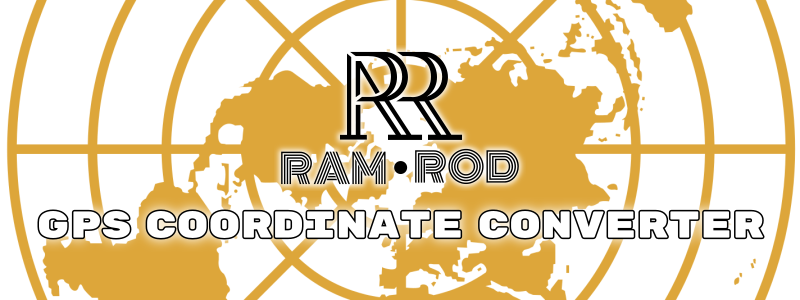
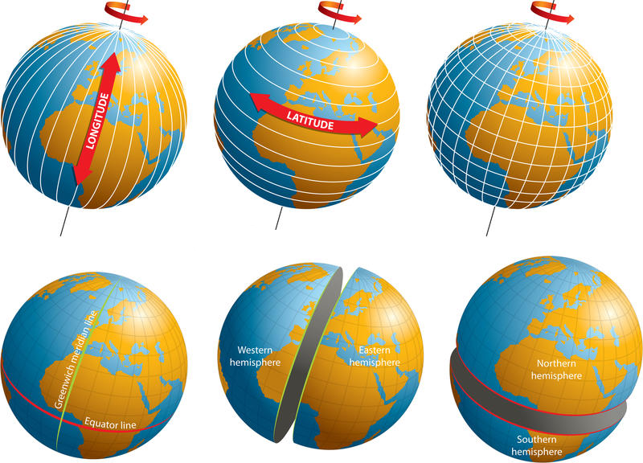

<p align="center"></p>  

___

#### Table of Contents
   [1.1 Azimuthal equidistant map projection definition](#A)  
   &nbsp; &nbsp; [1.1.1 Understanding Latitude and Longiutde](#A1)  
   [1.2 Installation](#B)  
   [1.3 Public members](#C)  
   &nbsp; &nbsp; [1.3.1 Constructor](#C1)  
   &nbsp; &nbsp; [1.3.2 Converting from GPS coordinates to X and Y distances](#C2)  
   &nbsp; &nbsp; [1.3.3 Converting from X and Y position to GPS coordinates](#C3)  
   &nbsp; &nbsp; [1.3.4 Calculating the distance between two GPS coordinates](#C4)  
   &nbsp; &nbsp; [1.3.5 Calculating the distance X and Y between two GPS coordinates](#C5)  
   [1.4 Type definition](#D)  
   [1.5 Getting started](#E)  

___
<a name="A"/><br/>  

## 1.1 Azimuthal equidistant map projection

The azimuthal equidistant map projection creates a map that puts points equidistant from the map's center in a circle surrounding it. It has the useful properties that all points on the map are at proportionately correct distances from the center point, and that all points on the map are at the correct azimuth (direction) from the center point. The most famous example is the flag of the United Nations which centers at the north pole. It is an interesting and complex projection that in the past was mainly used to create line drawings. Now, it can be done in realtime on a GPU in your web browser.

You can see an interactive map [here](http://rogerallen.github.io/webgl/2014/01/27/azimuthal-equidistant-projection/), use the mouse to move center of the map projection.
<a name="A1"/>  
### 1.1.1 Understanding Latitude and Longiutde

<p align="center">
   
</p>  

**Latitude** and **Longitude** are imaginary lines that separate the globe in sections; **latitude** are horizontal lines and separate the circunference *vertically*, they represent values in the **Y axis**. **Longitude** in the other hand are vertical lines and separate the circunference *horizontally*, they represent values in **X axis**. The **origin** of **XY** and **Lat-Long** coodinate systems are located where the *Ecuator* and *Greenwich (prime meridian)* lines intersect.
<br/><br/>

___
<a name="B"/><br/>  

## 1.2 Installation

This library does not require any additional libray, you only need to add the files to your **project's** folder and add the following lines to your **CMakeLists.txt**:
```Cmake
# Tripe points (...) represent possible content that may 
# already exist in your CMakeLists.txt
...
# Replace <gps_conversor_folder_path> with the actual folder path
add_subdirectory(<gps_conversor_folder_path>)
include_directories(${COORDINATE_DIRS})
...
# Replace <project_name> with the actual project name
target_link_libraries(<project_name>
  ...
  ${COORDINATE_LIB}
  ...
)
...
```
And add the next `include` line into your code:
```c++
#include "coordinate_conversor.h"
```
<br/>

___
<a name="C"/><a name="C1"/><br/>  

## 1.3 Public members

### 1.3.1 Constructor

This will construct this class, if you have an object which is constantly moving you could use its coordinates *(latitude and longitude)* as the parameters in the constructor so, when you call `GPS_to_XY()` or `XY_to_GPS()`, the object's latitude and longitude will be taken as the origin. This does not affect `distance()` or `distances()`.
```c++
template<typename T>
Toreo::CoordinateConversor<T>::CoordinateConversor(double *latitude = nullptr,
                                                   double *longitude = nullptr);
```

 &nbsp; **Arguments**

| Type | Name | Description |
| --- | --- | --- |
| [`double*`] | **latitude** | Latitude coordinate of the movable object. |
| [`double*`] | **longitude** | Longitude coordinate of the movable object. |
<br/>

___
<a name="C2"/><br/>  

### 1.3.2 Converting from GPS coordinates to X and Y distances

This function converts GPS **degree** coordinates to distance in meters from the **GPS position** to the **Object position** *(he object's position is the origin)* which was defined in the constructor.
```c++
Visualizer::pointXY<T> GPS_to_XY(double latitude, double longitude);
```

**Mathematical formulas** are as follows:
 * `x = longitude_to_meters - Object_longitude_to_meters`
 * `y = latitude_to_meters - Object_latitude_to_meters`

 &nbsp; **Arguments**

| Type | Name | Description |
| --- | --- | --- |
| [`double`] | **latitude** | Latitude coordinate to measure. |
| [`double`] | **longitude** | Longitude coordinate to measure. |

 &nbsp; **Returns**<br/>
 &nbsp; &nbsp; [`Visualizer::pointXY<T>`] &nbsp; | &nbsp; Position in meters with coordinates **X** and **Y** relative to the map's center defined at the constructor. (see [Types](#D) for more information about the `struct`).

 &nbsp; **Errors**<br />
 &nbsp; &nbsp; This will always return x = 0 and y = 0 if the *latitude* and *longitude* were not defined in the constructor.
 
<br/>

___
<a name="C3"/><br/>  

### 1.3.3 Converting from X and Y position to GPS coordinates

This function converts **X** and **Y** position *(in meters)* into GPS **degree** coordinates. The X and Y distances must be relative to the Object, the **X axis** is a line pointing east and the **Y axis** is a line pointing towards north and center at the Object position (defined at the constructor).
```c++
Visualizer::pointLL XY_to_GPS(T x, T y);
```

**Mathematical formulas** are as follows:
 * `latitude = to_GPS_coordinate(Object_latitude_to_meters + y)`
 * `longitude = to_GPS_coordinate(Object_longitude_to_meters + x)`

 &nbsp; **Arguments**

| Type | Name | Description |
| --- | --- | --- |
| [`T`] | **x** | Position **X** to measure relative to the object defined at the constructor. |
| [`T`] | **y** | Position **Y** to measure relative to the object defined at the constructor. |

 &nbsp; **Returns**<br/>
 &nbsp; &nbsp; [`Visualizer::pointLL`] &nbsp; | &nbsp; Coordinates **latitude** and **longitude**. (see [Types](#D) for more information about the `struct`).

 &nbsp; **Errors**<br />
 &nbsp; &nbsp; This will always return `latitude = 0` and `longitude = 0` if the *latitude* and *longitude* were not defined in the constructor.
 
<br/>

___
<a name="C4"/><br/>  

### 1.3.4 Calculating the distance between two GPS coordinates

This function calculates the **distance** between two GPS points, you must define the **start point** *(latitude, longitude)* and **end point** *(latitude, longitude)*.
```c++
T distance(double start_latitude, double start_longitude,
           double end_latitude, double end_longitude);
```

 &nbsp; **Arguments**

| Type | Name | Description |
| --- | --- | --- |
| [`double`] | **start_latitude** | Latitude of point 1. |
| [`double`] | **start_longitude** | Longitude of point 1. |
| [`double`] | **end_latitude** | Latitude of point 2. |
| [`double`] | **end_longitude** | Longitude of point 2. |

 &nbsp; **Returns**<br/>
 &nbsp; &nbsp; [`T`] &nbsp; | &nbsp; Distance in meters from *start point* to *end point*.

 &nbsp; **Errors**<br />
 &nbsp; &nbsp; This will return strange values if you do not introduces proper GPS coordinates.
 
<br/>

___
<a name="C5"/><br/>  

### 1.3.5 Calculating the distance X and Y between two GPS coordinates

This function calculates the **distance X** and **Y** between two GPS points, you must define a **start point** *(latitude, longitude)* and **end point** *(latitude, longitude)*.
```c++
Visualizer::pointXY<T> distances(double start_latitude, double start_longitude,
                                 double end_latitude, double end_longitude);
```

 &nbsp; **Arguments**

| Type | Name | Description |
| --- | --- | --- |
| [`double`] | **start_latitude** | Latitude of point 1. |
| [`double`] | **start_longitude** | Longitude of point 1. |
| [`double`] | **end_latitude** | Latitude of point 2. |
| [`double`] | **end_longitude** | Longitude of point 2. |

 &nbsp; **Returns**<br/>
 &nbsp; &nbsp; [`Visualizer::pointXY<T>`] &nbsp; | &nbsp; Distance in meters from *start point* to *end point* separated in **vector components**. (see [Types](#D) for more information about the `struct`).

 &nbsp; **Errors**<br />
 &nbsp; &nbsp; This will return strange values if you do not introduces proper GPS coordinates.
 
 <br/>
 
 ___
<a name="D"/><br/>
 
 ## 1.4 Type Definitions
 
There is two different types of **structures**:

```c++
namespace Visualizer {
  // Position in meters
  template<typename T>
  union pointXY{
    struct{
      T x; // Position in meters at the X axis (Longitude axis)
      T y; // Position in meters at the Y axis (Latitude axis)
    };
    T data[2];
  };
  
  // Position in degrees
  union pointLL{
    struct{
      double latitude;  // Latitude coordinate in degrees
      double longitude; // Longitude coordinate in degrees
    };
    double data[2];
  };
}
```

You could directly **choose a type** for the coordinate conversor using the following lines:

```c++
namespace Toreo {
  typedef CoordinateConversor<float> CoordinateConversorFloat;
  typedef CoordinateConversor<double> CoordinateConversorDouble;
  typedef CoordinateConversor<long double> CoordinateConversorLong;
}
```

Example:

```c++
// Use this:
double map_center_latitude{0.0};
double map_center_longitude{0.0};
Toreo::CoordinateConversotFloat gps_conversor(&map_center_latitude, &map_center_longitude);

// Instead of this:
double map_center_latitude{0.0};
double map_center_longitude{0.0};
Toreo::CoordinateConversot<float> gps_conversor(&map_center_latitude, &map_center_longitude);
```

<br/>

___
<a name="E"/><br/>

## 1.5 Getting started

The use of the coordinate conversor is really easy, here is an example in how to use the library.

```c++
#include "torero/coordinate_conversor.h"

#include <iostream>
#include <iomanip>

int main(int argc, char *argv[]){
  // ------------------------------------------------------------------------------------ //
  // ---------------------------- GPS COORDINATE CONVERSOR ------------------------------ //
  // ------------------------------------------------------------------------------------ //
  // Defining the map center (which you could move inside your code at any moment)
  double map_center_latitude{0.0};
  double map_center_longitude{0.0};

  // Creating our GPS coordinate conversor object
  Toreo::CoordinateConversor<float> conversor(&map_center_latitude, &map_center_longitude);

  // -------------------------------------------------------------------------------
  // Converting from coordinates to meters (relative to the map center)
  Visualizer::pointXY<float> point_1;
  point_1 = conversor.GPS_to_XY(50.774987, 6.085083);
  // Printing the values
  std::cout << std::setprecision(2) << std::fixed
            << "X: " << point_1.x << "m \n"
            << "Y: " << point_1.y << "m"
            << std::endl;

  // -------------------------------------------------------------------------------
  // Changing the map center location
  map_center_latitude = 50.0;
  map_center_longitude = 6.0;

  // -------------------------------------------------------------------------------
  // Converting from meters to coordinates (relative to the map center)
  Visualizer::pointLL point_2{conversor.XY_to_GPS(1000.0f, 2000.0f)};
  // Printing the values
  std::cout << std::setprecision(9) << std::fixed
            << "Latitude: " << point_2.latitude << "° \n"
            << "Longitude: " << point_2.longitude << "°"
            << std::endl;

  // -------------------------------------------------------------------------------
  // Setting the points A and B
  double start_latitude = 50.774987;
  double start_longitude{6.085083};
  double end_latitude{51.774987};
  double end_longitude = 7.085083;
  // Calculating the distance from point A to B
  float distance{conversor.distance(start_latitude, start_longitude,
                                    end_latitude, end_longitude)};
  // Printing the values
  std::cout << std::setprecision(2) << std::fixed
            << "Distance: " << distance << "m"
            << std::endl;


  // -------------------------------------------------------------------------------
  // Calculating the distance from point A to B
  Visualizer::pointXY<float> distances{conversor.distances(start_latitude, start_longitude,
                                                           51.774987, 7.085083)};
  // Printing the values
  std::cout << std::setprecision(2) << std::fixed
            << "Distance in X: " << distances.x << "m \n"
            << "Distance in Y: " << distances.y << "m"
            << std::endl;

  return 0;
}
```
